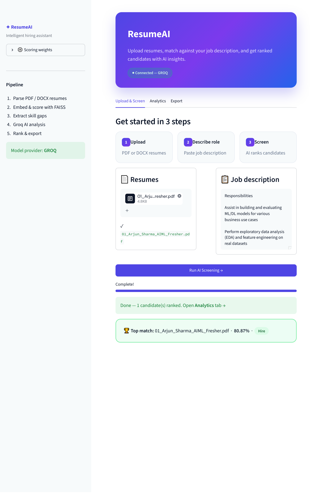
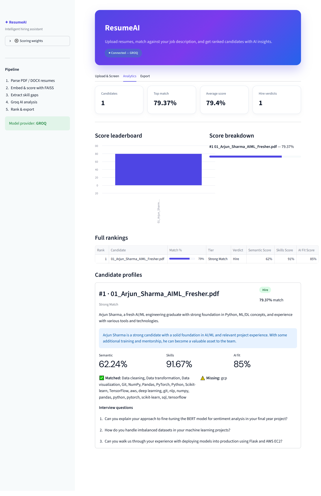
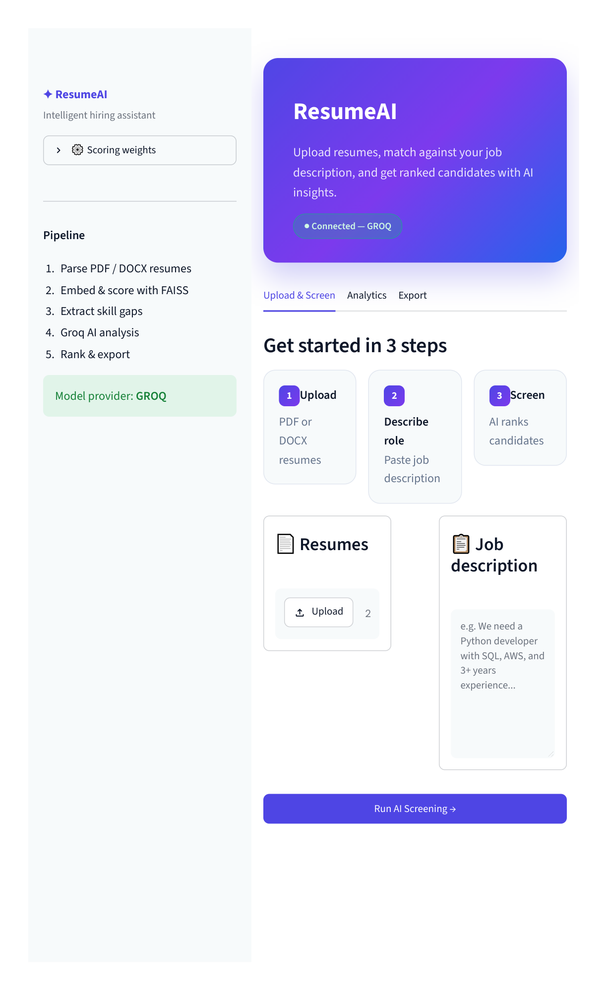

# AI Resume Screening Agent

[](https://github.com/Shiva-Sirimalla/Ai-resume-screening-agent)
[](https://www.python.org/)
[](https://streamlit.io/)

100% Python resume screening — semantic matching, skill gaps, AI verdicts, and a modern Streamlit dashboard powered by **Groq**.

## Screenshots

### ResumeAI home


### AI screening results


### App overview


## Features

- **Multi-signal scoring** — semantic similarity (FAISS), skill overlap, AI fit score
- **Groq LLM analysis** — summary, verdict (Hire/Maybe/Reject), interview questions
- **Real-time Streamlit UI** — upload resumes, live progress, ranked dashboard
- **Export** — CSV and JSON reports
- **CLI mode** — screen resumes from the terminal

## Quick start

```bash
git clone https://github.com/Shiva-Sirimalla/Ai-resume-screening-agent.git
cd Ai-resume-screening-agent
python setup_env.py
```

Edit `.env` and set your `GROQ_API_KEY`, then:

```bash
python main.py check
python main.py
```

Opens the UI at **http://localhost:8501**

## Commands

| Command | What it does |
|---------|----------------|
| `python main.py` | Start Streamlit web UI |
| `python main.py check` | Verify dependencies and API key |
| `python main.py screen --jd job.txt --resumes ./resumes/` | Screen from terminal, save CSV |

### CLI example

```bash
python main.py screen --jd job_description.txt --resumes resume1.pdf resume2.docx --output results.csv
```

## Setup manually

```bash
pip install -r requirements.txt
```

Copy `.env.example` to `.env` and add one API key:

```
GROQ_API_KEY=gsk-your-key-here
LLM_PROVIDER=groq
```

Also supports `GROK_API_KEY`, `XAI_API_KEY`, or `OPENAI_API_KEY`.

## Project structure

```
Ai-resume-screening-agent/
├── main.py              # Python entry point
├── setup_env.py         # Install deps + create .env
├── app.py               # Streamlit dashboard
├── agents/              # LLM screening + ranking
├── parser/              # PDF & DOCX extraction
├── resume_core/         # Scoring, skills, pipeline
├── ui/                  # Theme and styling
└── docs/screenshots/    # README screenshots
```

## Scoring

- **Semantic** — embedding similarity (FAISS + Sentence Transformers)
- **Skills** — keyword overlap with job description
- **AI Fit** — LLM score (0–100)
- **Composite** — weighted final rank (adjust in UI sidebar)

## Refresh screenshots

With the app running (`python main.py`):

```bash
pip install playwright
python -m playwright install chromium
python scripts/capture_screenshots.py
```

## Author

[Shiva-Sirimalla](https://github.com/Shiva-Sirimalla)
