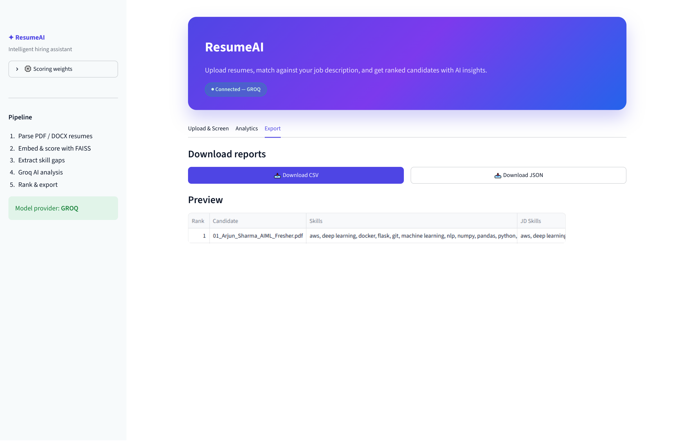

# AI Resume Screening Agent

[](https://github.com/Shiva-Sirimalla/Ai-resume-screening-agent)
[](https://www.python.org/)
[](https://streamlit.io/)

## Synopsis

**ResumeAI** is an intelligent resume screening system that helps recruiters and hiring teams evaluate candidates faster and more consistently. Instead of manually reading every resume, you upload multiple PDF or DOCX files, paste a job description, and the app automatically ranks candidates using a multi-layer scoring engine.

The system combines **semantic matching** (FAISS + Sentence Transformers), **skill-gap analysis**, and **Groq-powered LLM evaluation** to produce a composite match score, hire verdict (Hire / Maybe / Reject), candidate summaries, and tailored interview questions — all through a modern **Streamlit** dashboard.

Built entirely in **Python**, ResumeAI is designed for real-world hiring workflows: batch resume processing, live screening progress, analytics dashboards, and CSV/JSON export for sharing results with your team.

### Tech stack

| Layer | Tools |
|-------|-------|
| UI | Streamlit |
| LLM | Groq (Llama 3.3), Grok, or OpenAI |
| Embeddings | Sentence Transformers (`all-MiniLM-L6-v2`) |
| Vector search | FAISS |
| Parsing | pdfplumber, python-docx |
| Language | Python 3.11+ |

### Who is it for?

- Recruiters screening large applicant pools  
- HR teams comparing resumes against a job description  
- Developers learning AI agents, RAG-style matching, and LLM integrations  

## Screenshots

### 1. App overview


### 2. Home page


### 3. AI screening results


### 4. Download reports


> Source files in `screenshots/` (numbered PDFs). Refresh: `python scripts/update_screenshots.py`

## Features

- **Multi-signal scoring** — semantic similarity (FAISS), skill overlap, AI fit score
- **Groq LLM analysis** — summary, verdict (Hire/Maybe/Reject), interview questions
- **Real-time Streamlit UI** — upload resumes, live progress, ranked dashboard
- **Export** — CSV and JSON reports
- **CLI mode** — screen resumes from the terminal

## Quick start

```bash
git clone https://github.com/Shiva-Sirimalla/Ai-resume-screening-agent.git
cd Ai-resume-screening-agent
python setup_env.py
```

Edit `.env` and set your `GROQ_API_KEY`, then:

```bash
python main.py check
python main.py
```

Opens the UI at **http://localhost:8501**

## Commands

| Command | What it does |
|---------|----------------|
| `python main.py` | Start Streamlit web UI |
| `python main.py check` | Verify dependencies and API key |
| `python main.py screen --jd job.txt --resumes ./resumes/` | Screen from terminal, save CSV |

### CLI example

```bash
python main.py screen --jd job_description.txt --resumes resume1.pdf resume2.docx --output results.csv
```

## Setup manually

```bash
pip install -r requirements.txt
```

Copy `.env.example` to `.env` and add one API key:

```
GROQ_API_KEY=gsk-your-key-here
LLM_PROVIDER=groq
```

Also supports `GROK_API_KEY`, `XAI_API_KEY`, or `OPENAI_API_KEY`.

## Project structure

```
Ai-resume-screening-agent/
├── main.py              # Python entry point
├── setup_env.py         # Install deps + create .env
├── app.py               # Streamlit dashboard
├── agents/              # LLM screening + ranking
├── parser/              # PDF & DOCX extraction
├── resume_core/         # Scoring, skills, pipeline
├── ui/                  # Theme and styling
└── docs/screenshots/    # README screenshots
```

## Scoring

- **Semantic** — embedding similarity (FAISS + Sentence Transformers)
- **Skills** — keyword overlap with job description
- **AI Fit** — LLM score (0–100)
- **Composite** — weighted final rank (adjust in UI sidebar)

## Refresh screenshots

Replace PDFs in `screenshots/`, then:

```bash
pip install pymupdf
python scripts/update_screenshots.py
```

## Author

[Shiva-Sirimalla](https://github.com/Shiva-Sirimalla)
